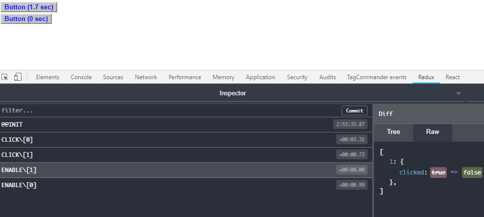

# Redux Composite

Composing high-level [Labelled transition system](https://en.wikipedia.org/wiki/Transition_system) from small ones.

:white_check_mark:
The library allows low-level system implementations being independent from the high-level system structure.
This way low-level systems could be re-usable in different high-level systems.

## Problem statement

Imagine, we have a simple reducer
```
const Reducer = (state, action) => {
    if (state === undefined) {
        return {clicked: false};
    }
    switch (action.type) {
        case 'CLICK':
            return {clicked: true};
        case 'ENABLE':
            return {clicked: false};
        default:
            return state;
    }
};
```
We can easily use this reducer in Redux with `createStore`.
But what if now we need to update our global state having array of 2 these states?
Like `[{clicked: bool}, {clicked: bool}]`.

I can't do `combineReducers({first: Reducer, second: Reducer})` - because both have the same action types.
Without changing reducer it seems like not possible.
Moreover, I may have a middleware, using `dispatch` expecting this data structure, not the array of 2.
Modifying reducers and middlewares may not be good solution. It could be package library, that you don't want to change.

## Solution

Within `Redux Composite` you simply have composite state-manager like this: `Structure([Reducer, Reducer])`.

Or if with `Middleware`, we define it like:
```
Structure([
    Composite({reducer: Reducer, middleware: Middleware}),
    Composite({reducer: Reducer, middleware: Middleware})
])
```

And here how it looks in action:




- buttons do not know about global state structure
- original reducer and middleware is used for each button

## Documentation

See [full documentation here](doc/index.md)
